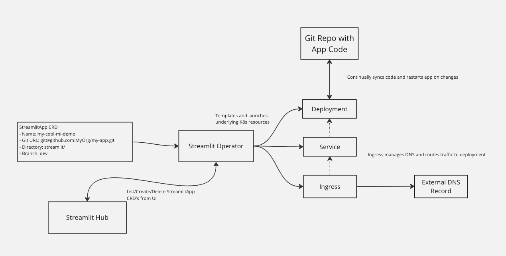

# Streamlit Operator

Streamlit apps are easy to develop, but can be a pain to deploy and keep up to date. The Streamlit Operator makes deploying a streamlit
app as easy as filling out a few fields in a web UI. Plus, it will keep your app up to date with your code via a continuous git sync, so you can focus on building.
If you're already using Kubernetes, this is the easiest way to deploy your apps.

## Prerequisites

This app has been developed under the assumption that you're running a cluster on EKS in AWS. It will likely work on other clusters
with minimal changes, but this has not been tested.

## Installation

The Streamlit Operator comes prepackaged as a Helm chart.  If you've never used helm, please refer to
Helm's [documentation](https://helm.sh/docs) to get started.

Once Helm has been set up correctly, add the repo as follows:

    helm repo add streamlit-operator https://document-crunch.github.io/streamlit-operator/

If you had already added this repo earlier, run `helm repo update` to retrieve
the latest versions of the packages.  You can then run `helm search repo
<alias>` to see the charts.

To install the chart run:

    helm install streamlit-operator streamlit-operator/streamlit-chart --set baseDnsRecord=<YOUR-COMPANY>.com

To uninstall the chart:

    helm delete streamlit-operator

After installation, you should have an operator running in a newly created streamlit namespace, as well as a hub app
running at `hub-streamlit.<YOUR-COMPANY>.com`. 

## Usage

The operator is built around one StreamlitApp CRD that takes required configuration for each app. 

Currently users must specify four pieces of config:

- `name`: The name of the app. This will be used as the name of the deployment, service, ingress, and DNS record.
- `repo`: The git style URL of the repo containing the app code. This is used to clone the repo into the container. e.g. `git@github.com:MyOrg/my-app.git`
- `branch`: The branch of the repo to use. Typical usecase will be to track main, but users can also work off development branches.
- `code_dir`: The directory within the repo that contains the app code. This is used to run `streamlit run` within the container. e.g. `my-app` 
  - Note that the operator assumes your app's entrypoint is `main.py` within this directory. This will be configurable in the future.

## Architecture

